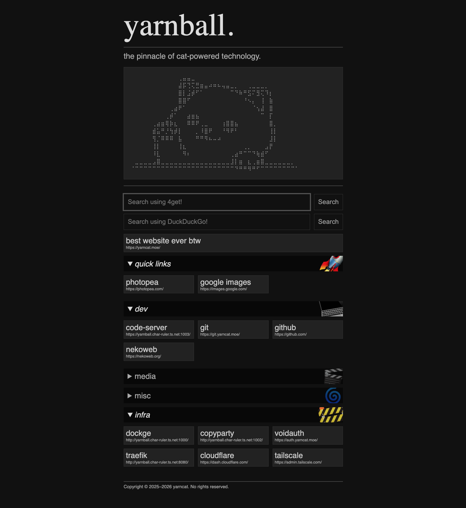
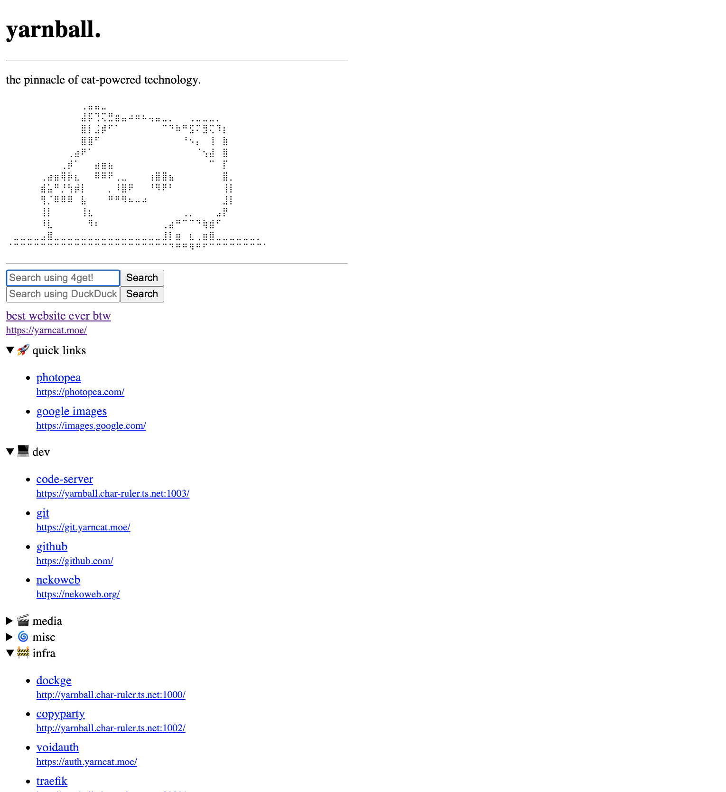

# ducky!

a minimal and hackable dashboard for your homelab.

| regular | minimal |
|:---:|:---:|
|  |  |

minimal mode is accessible by putting `?min` at the end of the URL.

## prerequisites
- docker and docker-compose
- bun (for development)

## installation

```sh
# clone the git repository
git clone https://github.com/yaaaarn/ducky && cd ducky

# copy configuration files
cp -r config.example config

# start the container
docker compose up -d
```

after starting, visit: http://localhost:6767

## configuration

the config directory is located at `./config`.

> also note that you can add your own components by modifying the source directly or maintaining your own fork (recommended for long-term customization).

### components

#### `item`

```yaml
- name: github
  url: https://github.com
```

#### `category`

```yaml
- type: category
  name: links
  emoji: 🔗
  open: true
  items:
    - name: google
      url: https://google.com
    - name: nekoweb
      url: https://nekoweb.org
    - name: discord
      url: https://discord.com
```

#### `html`

```yaml
- type: html
  html: |
    <strong>this is bold</strong>
```

#### `search`

```yaml
- type: search
  placeholder: Search using DuckDuckGo!
  url: https://duckduckgo.com/search
  name: q
```

## development

```sh
# clone git repository
git clone https://github.com/yaaaarn/ducky

# install dependencies
bun install
```

### live server

this will open the server at http://localhost:3000.

```
bun run dev
```

### building

running this will compile the entire source into a quick single-file executable.

```sh
bun run build
```